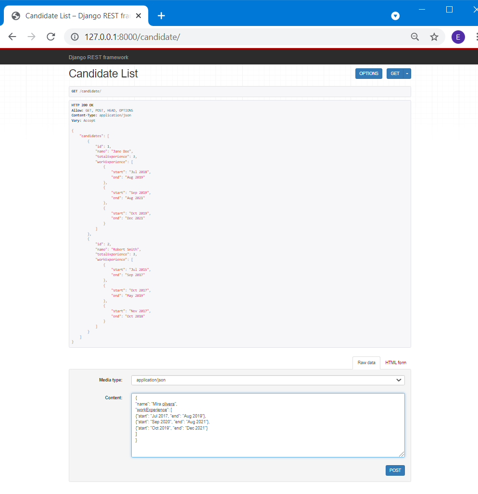

# Calculation_experience
Instructions:
- Download project 
- Open project in IDE
- In a root folder (one where 'manage.py` located) run commands:  

```
pip install -r requirements.txt
python manage.py makemigrations
python manage.py migrate
python manage.py runserver
```

After that, you need to go to the address in the browser: http://127.0.0.1:8000/candidate/ . 
As a result, you will see the following page:




